# 🎯 CheermateApp - Complete Task Management System

A comprehensive Android task management application built with Kotlin, featuring complete CRUD operations, smart task features, and modern UI design.

## ✨ Features

### 🔥 Complete CRUD Operations
- **✅ CREATE**: Add new tasks with detailed forms (title, description, priority, status, due date/time)
- **✅ READ**: View, filter, and search tasks with real-time updates
- **✅ UPDATE**: Complete edit functionality with pre-filled forms and progress tracking
- **✅ DELETE**: Hard delete with confirmation dialogs

### 🎨 Modern UI Features
- **📱 Card-based Task Display**: Single task focus with navigation
- **🔍 Advanced Filtering**: All, Today, Pending, Done with live counts
- **🔎 Real-time Search**: Search by title and description
- **📊 Sort Options**: Date, Priority, Title, Status, Progress
- **⏮️⏭️ Task Navigation**: Previous/Next with counter display
- **🎯 Quick Actions**: Mark as Done, Edit, Delete
- **🏷️ Color-coded Priorities**: Visual priority indicators
- **📅 Date/Time Pickers**: Professional date and time selection
- **🌙 Dark Mode**: Functional light/dark theme support with persistent preferences

### 🗄️ Database Features
- **SQLite Database**: Local data persistence with Room
- **Timestamp Management**: Human-readable String timestamp handling
- **User-specific Data**: Multi-user support with user isolation
- **📦 Caching System**: JSON-based caching for static data with automatic invalidation

### 🚀 Phase 2: Smart Task Features (v1.5) ✨ NEW
- **🔄 Recurring Tasks**: Daily, weekly, monthly, and yearly recurring tasks
- **📋 Task Templates**: Reusable templates for common workflows
- **❌ Task Dependencies**: Prerequisite task relationships (REMOVED)
- **📦 Bulk Operations**: Multi-select and batch edit tasks
- **📊 Analytics**: Productivity trends, time-based analytics, streak tracking
- **💾 Data Export/Import**: CSV and JSON export with backup/restore functionality
- **⚡ Performance**: Database-backed caching reduces queries by ~90% for static data

## 🛠️ Technology Stack

- **Language**: Kotlin
- **UI**: Android Views with Material Design
- **Database**: SQLite with Room persistence library (v37)
- **Caching**: JSON-based caching with Gson for static data
- **Architecture**: MVVM pattern with LiveData
- **Async Operations**: Coroutines with Dispatchers
- **Navigation**: Intent-based activity navigation
- **Theme**: Material3 DayNight with persistent theme preferences

## 📱 Screenshots

| | | |
|:-------------------------:|:-------------------------:|:-------------------------:|
| 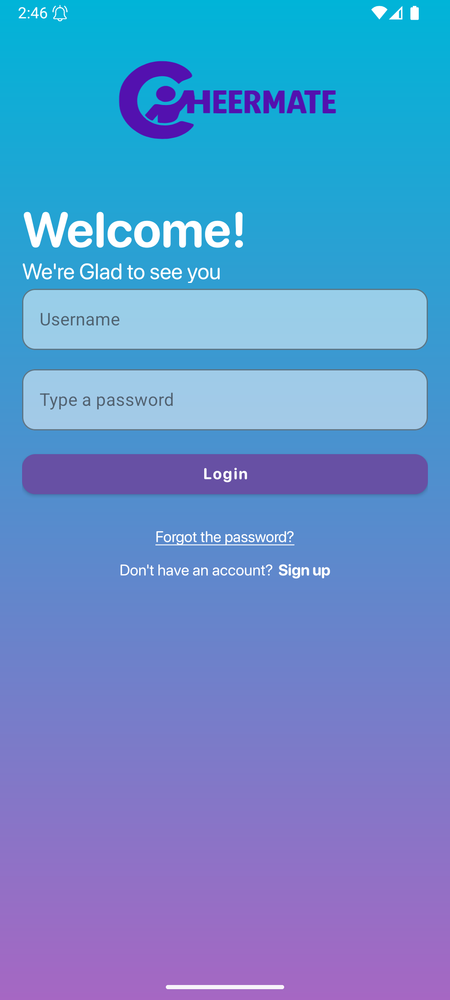 | 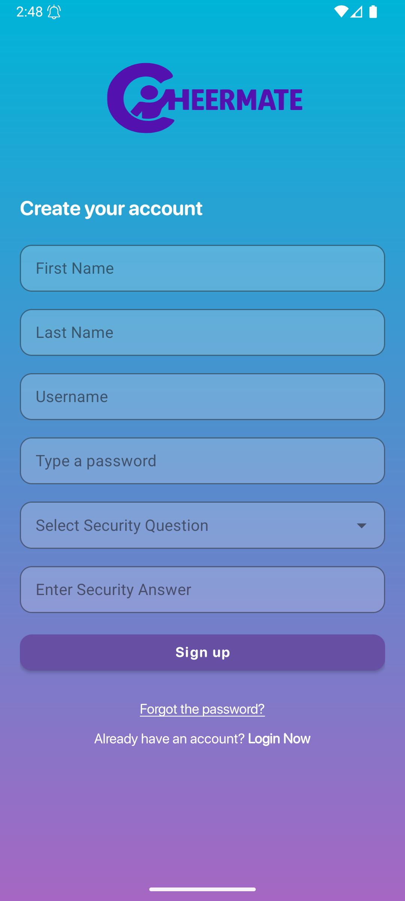 | 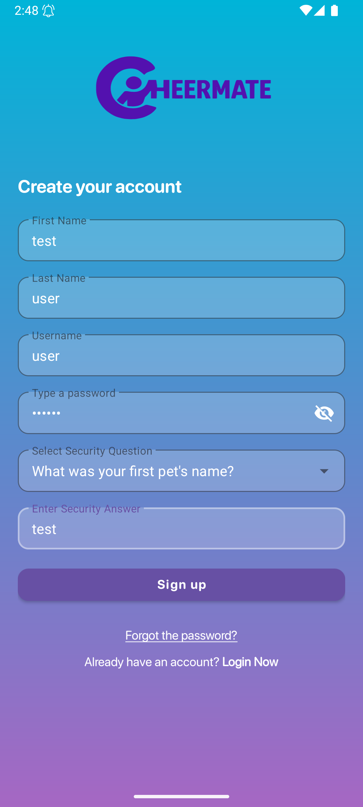 |
| 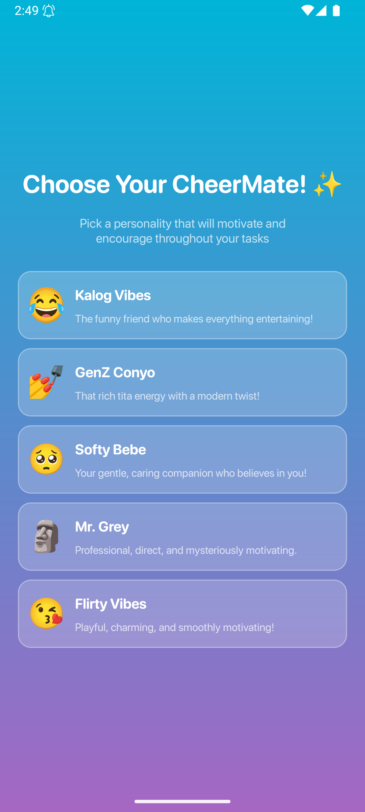 | 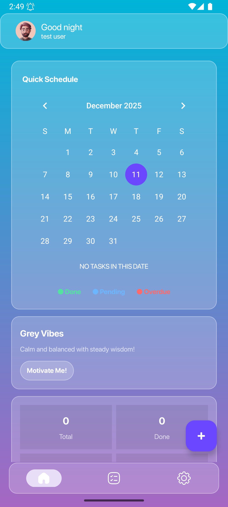 | 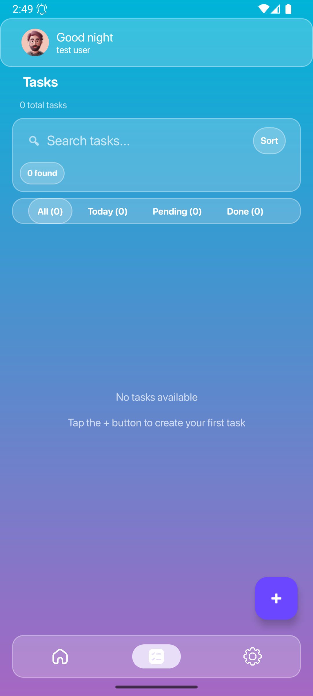 |
| 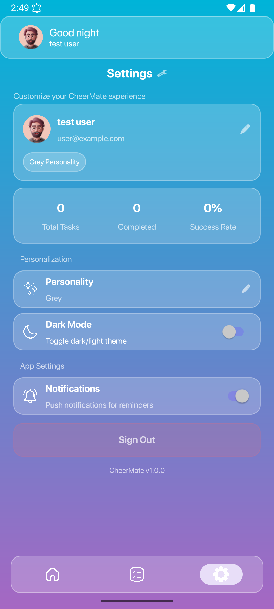 | 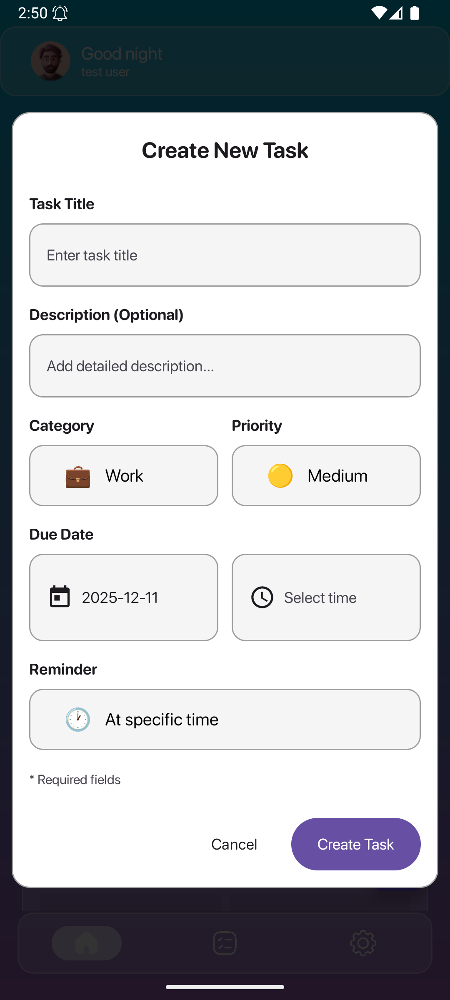 | 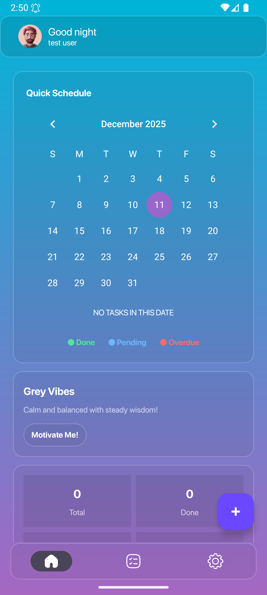 |
| 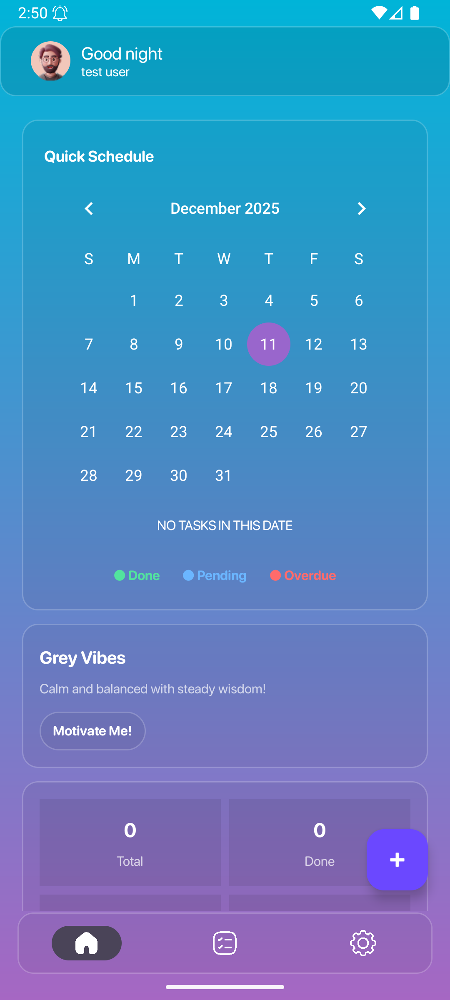 | 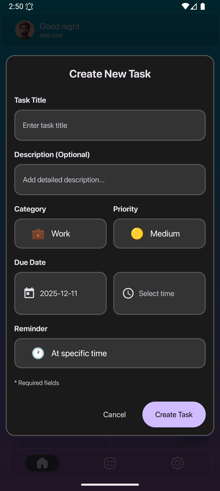 | 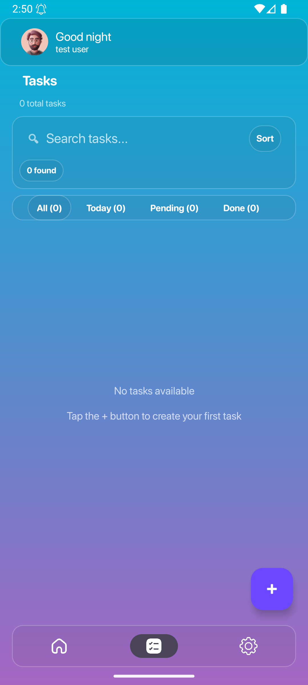 |
| 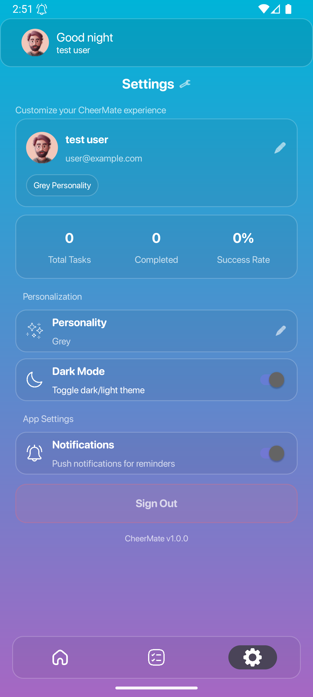 | | |

## 📋 Development

### 🚀 New Here? Start with **[QUICKSTART.md](QUICKSTART.md)** - Your guide to the project!

### Documentation
- **[QUICKSTART.md](QUICKSTART.md)** - Quick reference guide for contributors
- **[CACHING_SYSTEM_GUIDE.md](CACHING_SYSTEM_GUIDE.md)** - Database-backed caching system documentation
- **[TODO.md](TODO.md)** - Immediate tasks and known issues to address
- **[ROADMAP.md](ROADMAP.md)** - Long-term development roadmap and feature planning
- **[CHANGELOG.md](CHANGELOG.md)** - Version history and changes

### Current Status
- **Version:** 1.5 (Phase 2 - Core Features Implemented)
- **Status:** Active Development
- **Current Milestone:** v1.5 - Enhanced UX & Smart Features (Q2 2025)
- **Next Milestone:** v2.0 - Cloud & Collaboration (Q3 2025)

## 🚀 Getting Started

### Prerequisites
- Android Studio Arctic Fox or later
- Kotlin 1.9+
- Android SDK 24+

### Installation
1. Clone the repository
